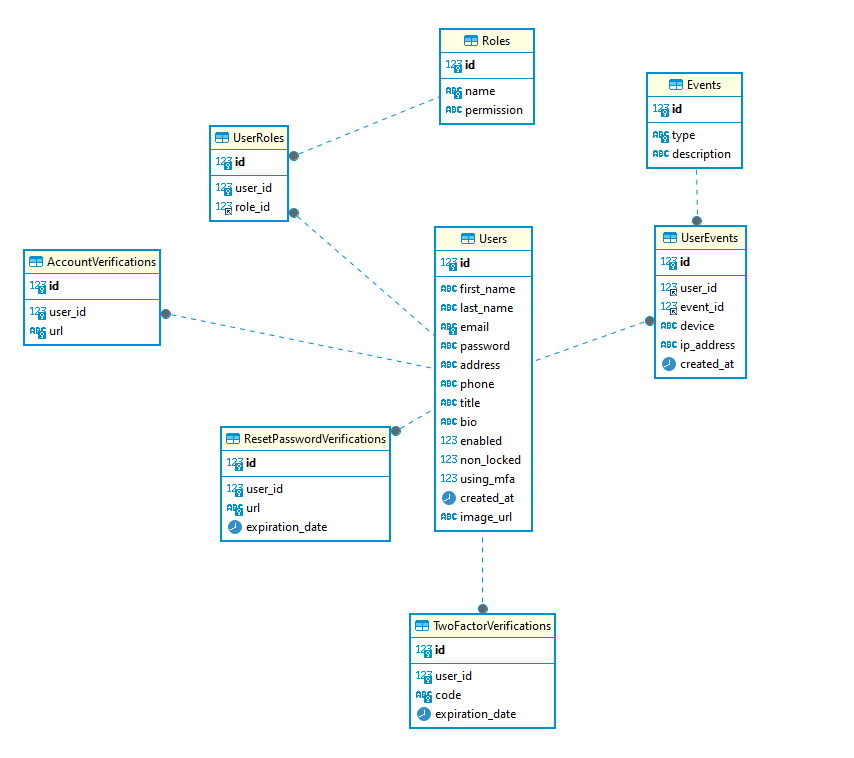

# Requisitos da Aplicação

## Usuário da Aplicação

1. **Criar nova conta de usuário (endereço de e-mail único)**
    - Verificação de conta (verificar endereço de e-mail)
    - Imagem de perfil do usuário
    - Detalhes do usuário (nome, e-mail, cargo, biografia, **telefone**, endereço, etc.)
    - Capacidade de atualizar informações detalhadas do usuário

2. **Redefinir senha do usuário (sem estar logado)**
    - O link de redefinição de senha deve expirar em 24 horas

3. **Login do usuário (usando e-mail e senha)**
    - Autenticação baseada em token (Token JWT)
    - Atualização transparente do Token de Atualização

4. **Mitigação de ataque de força bruta (mecanismo de bloqueio de conta)**
    - Bloquear conta após 6 tentativas de login malsucedidas

5. **Acesso à aplicação baseado em função e permissão (ACL)**
    - Proteger recursos da aplicação usando funções e permissões

6. **Autenticação de dois fatores (usando número de telefone do usuário)**
    - Enviar código de verificação para o telefone do usuário

7. **Manter o registro das atividades do usuário (login, alteração de conta, etc.)**
    - Capacidade de relatar atividades suspeitas
    - Informações de rastreamento
        - Endereço IP
        - Dispositivo
        - Navegador
        - Data
        - Tipo

## Clientes

1. **Informações do Cliente**
    - Gerenciar informações do cliente (nome, endereço, etc.)
    - O cliente pode ser uma pessoa ou uma instituição
    - O cliente deve ter um **status**
    - O cliente terá faturas
    - Imprimir clientes em planilha

2. **Pesquisar Clientes**
    - Capacidade de pesquisar clientes por nome
    - Paginação

## Faturas

1. **Gerenciar Faturas**
    - Criar novas faturas
    - Adicionar faturas ao cliente
    - Imprimir faturas para envio pelo correio
    - Imprimir faturas em planilha
    - Baixar faturas em PDF

## Banco de dados:
